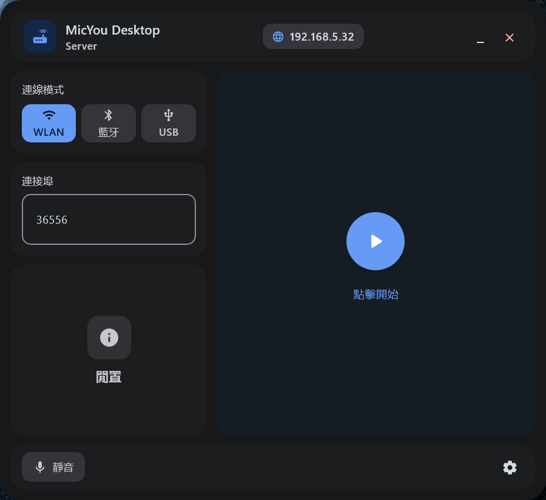

  
  <h1>MicYou</h1>
  
  

   
   

  

  <a href="./README_zh-cn.md">简体中文</a> | <b>繁體中文</b> | <a href="./README.md">English</a>

  
  
  

  <h6>贊助我</h6>

  

  MicYou 是一款強大的工具，能夠將您的 Android 裝置轉變為 PC 的高品質麥克風。它採用 Kotlin Multiplatform 與 Jetpack Compose/Material 3 構建。

## 主要功能

- **多種連線模式**：支援 Wi-Fi、USB (ADB/AOA) 與藍牙連線
- **音訊處理**：內建噪聲抑制、自動增益控制 (AGC) 與去混響功能
- **跨平台支援**：
  - **Android 客戶端**：採用現代 Material 3 設計，支援深色與淺色主題
  - **桌面端服務端**：可在 Windows、Linux 與 macOS 上接收音訊
- **虛擬麥克風**：搭配 VB-Cable 或 BlackHole 可作為系統麥克風輸入使用
- **高度可自訂**：支援調整取樣率、聲道數與音訊格式

## 軟體截圖

### Android 客戶端
|                            主畫面                             |                           設定                               |
|:-----------------------------------------------------------:|:-------------------------------------------------------------:|
|  |  |

### 桌面端

## 使用說明
快速開始指南及各平台安裝說明已移至常見問題文件：

- [快速開始](./docs/FAQ_TW.md#快速開始)
- [常見問題 (FAQ)](./docs/FAQ_TW.md#常見問題)

## 貢獻指南

我們歡迎各種形式的貢獻！無論是回報 Bug、提出功能建議、協助翻譯還是貢獻程式碼，都請參閱我們的 [貢獻指南](./CONTRIBUTING_zh-tw.md) 以開始參與。

## Contributors

Made with [contrib.rocks](https://contrib.rocks).

## Star History

<a href="https://www.star-history.com/#LanRhyme/MicYou&type=date&legend=top-left">
 <picture>
   <source media="(prefers-color-scheme: dark)" srcset="https://api.star-history.com/svg?repos=LanRhyme/MicYou&type=date&theme=dark&legend=top-left" />
   <source media="(prefers-color-scheme: light)" srcset="https://api.star-history.com/svg?repos=LanRhyme/MicYou&type=date&legend=top-left" />
   
 </picture>
</a>